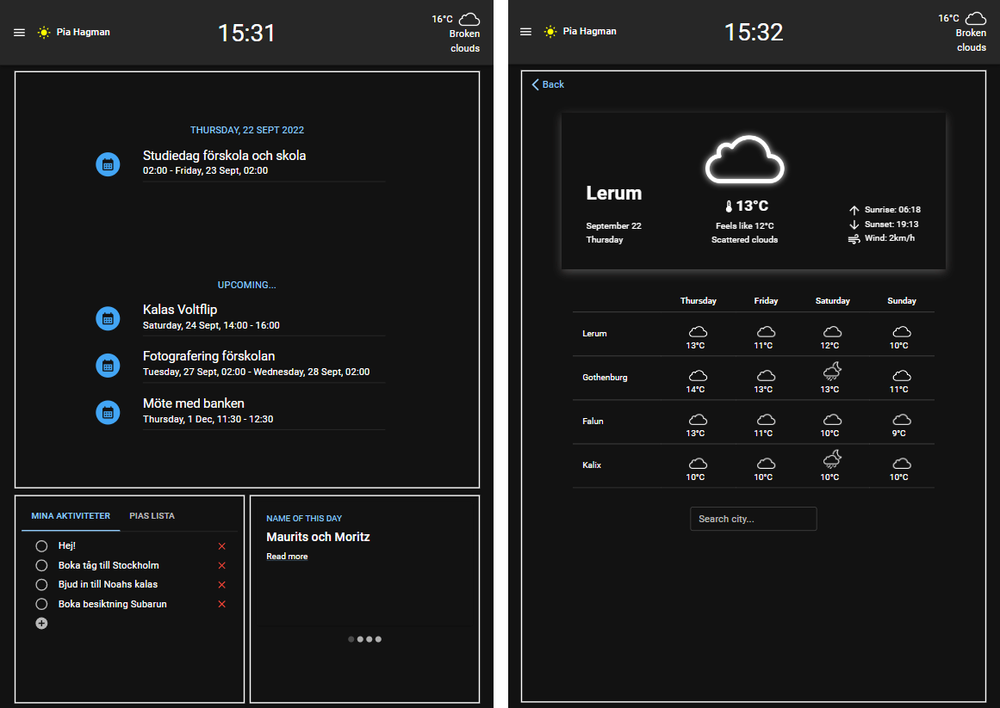

# React Home Application

## Project team

[Anna Märta Hjalmarson](https://github.com/Martason)  
[Johan Fahlgren](https://github.com/johan-fahlgren)  
[Kim Björnsen Åklint](https://github.com/Bjornsen016)  
[Pia Hagman](https://github.com/PiaHagman)

## App description

This is a Home Application built in ReactJS. The purpose of the application is to gather essential services to give you an overview of your google calendar and what's happening today. Currently this application consists of a calender view as well as task lists (todo's), fetched from your existing google-account. It also have features as Fact of the Day and Weather Forecast for your current position. Finally you also have the possibility to search for locale commute traffic from the location of your choice. These features are composed to fit in a one-page UI and it can be customized by you.   

In this version of the application there is only one routing, except from index; `/weather`, which is reached by clicking the weather widget in the top right corner. This route is a weather forecast component which includes forecasts of four locations (your position (or Stockholm as default), Gothenburg, Falun and Kalix). You can also search for city forecasts of your choice.   

The application is scalable and other nice features to have, for example your unread emails, a component to show Spotify, news updates etc, could be added to the list of components to choose from.   

## External API's and libraries

This application uses a bunch of different external API's to fetch data from other sources. Some examples are

- [Google]()
- [Open Weather Map](https://openweathermap.org/api)
- [Västtrafik](https://developer.vasttrafik.se/portal/#/)
- [Days Of The Year](https://www.daysoftheyear.com/%22%3edays)
- [On this day](https://byabbe.se/on-this-day/)
- [Joke API](https://v2.jokeapi.dev/)
- [Name of the Day](https://sholiday.faboul.se/)

For design and responsive content we have mainly used [MUI](https://mui.com/).

## Important when using this app

- You currently need an invite from one of us to make your google account to be connected to this app.
- To unlock the grid, and customize the UI, right click on the box to see alternatives of content to choose from.

### After downloading of project

- Use `npm i` (to install all dependencies) and then `npm start`.
- You need to accept the app when logging in with your google account.
- In order for the "Event of the Day" api call to work you need to go through a proxy. Activate temporary access to the demo server on https://cors-anywhere.herokuapp.com/corsdemo.
- You need to accept to be tracked by the app to get weather forecast for your position. If not accepted, Stockholm is default position.
